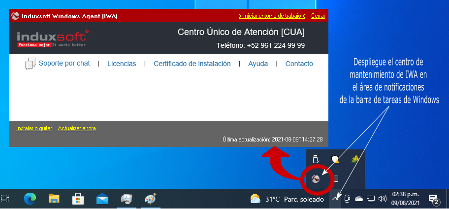

# Instalar Devkron en Windows con IIS a través de IWA
## Pre-requisitos
* .Net Framework 4.5 o superior
* IIS 8 o superior con ASP.Net 4.5 o superior

Internet Information Services es una característica de Windows que se puede instalar a través del menú Inicio. En menú Inicio busque Activar o desactivar las características de Windows.

Busque y seleccione Internet Information Services instalar IIS.

## Instalación
1. Descargar e instalar IWA

[Descargue](https://induxsoft.net/dwnload.php?id=e4978751dfc244d4a48af47e161a91ec) y ejecute el programa de instalación del Induxsoft Windows Agent [IWA] desde el sitio Web oficial de Induxsoft.

https://induxsoft.net/?idpf=e7478a10d09147fcb0203bae001c8290

Complete el asistente de instalación de IWA

2. Instale Devkron

Abra el centro de mantenimiento de IWA en la sección de notificaciones de la barra de Windows

Haga click en “Instalar o actualizar” y busque la aplicación “Devkron Language”

3. Complete la configuración

Abra la “Herramienta de configuración de Devkron” para que habilite el controlador de IIS y realice las configuraciones para que el servidor Web pueda entregar páginas dinámicas programadas en DKL.

