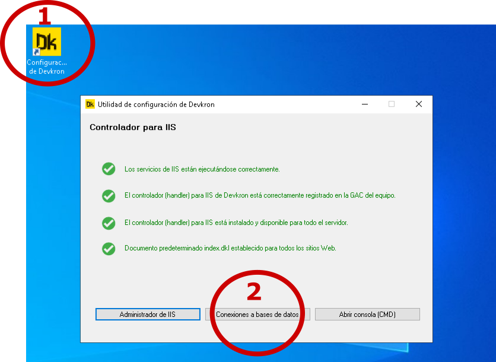
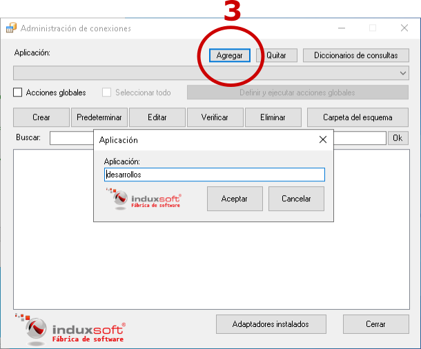
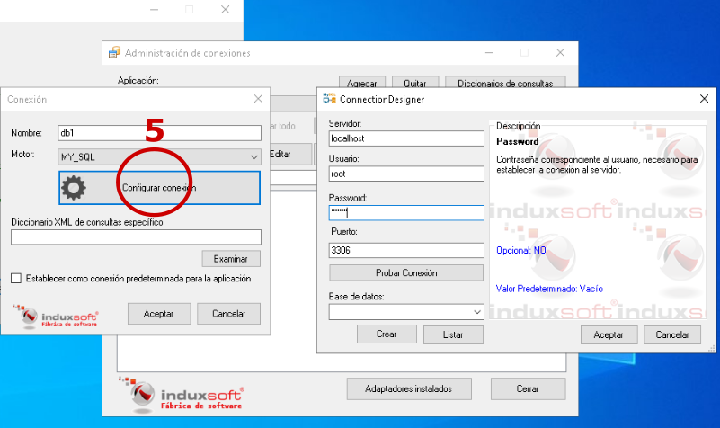

## Crear una base de datos y configurar una conexión

La interfaz del administrador de conexiones (disponible en Windows) permite crear bases de datos (con el patrón de estructura de Devkron) y/o configurar conexiones a bases de datos existentes.

Siga los siguientes pasos para crear una base de datos y configurar una conexión:

1. Abra la herramienta de configuración de Devkron
2. Haga click en el botón 'Conexiones a bases de datos' 



3. Agregue un nuevo grupo de aplicaciones (un grupo de aplicaciones permite organizar sus conexiones)
  Los nombres de grupos de aplicaciones no deben contener espacios en blanco ni los caracteres: '@' y '/'



4. Agregue una nueva conexión
  Los nombres de conexiones solo pueden contener letras (a-z), números (0-9), puntos (.) y guiones (-_)


5. Configure los datos para establecer la conexión al servidor de bases de datos



De acuerdo al ejemplo, ahora puede conectarse a través de código DKL con la sintaxis siguiente:

``` DKL

#include "dkli.dkh"
#!
program "ejemplo-conexion"
{
  #include "dbr.dkh"
  
  ref db=dbr.open("db1@desarrollos")
}

```
