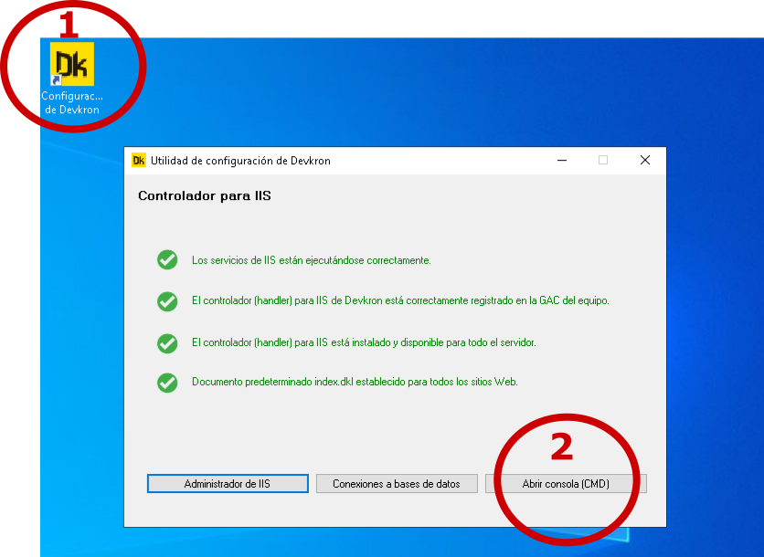
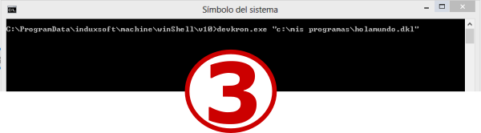

## Ejecutar programas (de consola) de Devkron

Esta guía aplica si instalaste Devkron a través de IWA en un equipo con Windows.

Si aun no has instalado Devkron, [puedes ver la guía de instalación aquí](../Instalacion/Windows-con-IWA/Instalar-DKL-Win-IWA.md)

Para ejecutar un programa de consola escrito en DKL, haz lo siguiente:

1. Abre la herramienta de configuración de Devkron
2.  Haz click en el botón 'Abrir consola (CMD)' para ir a la consola en la ubicación de instalación
3. Escribe: devkron.exe, un espacio enblanco,  luego la ruta y nombre del programa que quieres ejecutar (entre comillas) y presiona ENTER 




IWA Instala Devkron en Windows en la carpeta:
``` CMD
%ProgramData%\induxsoft\machine\winShell\v10\
```
La variable de entorno ```%ProgramData%``` apunta generalmente a: ```c:\ProgramData```

Si vas a utilizar Visual Studio Code o cualquier otro editor de código, generalmente es útil agregar esta ruta a la variable de entorno PATH del sistema.

Aquí tienes algunas guías para agregar rutas a la variable de entorno PATH con las que puedes orientarte:

* https://answers.microsoft.com/es-es/windows/forum/all/windows-10-variables-de-entorno-windows-10-version/703ea5fa-1db4-46da-8ff7-6261140bf58b
* https://docs.microsoft.com/en-us/previous-versions/office/developer/sharepoint-2010/ee537574(v=office.14)
