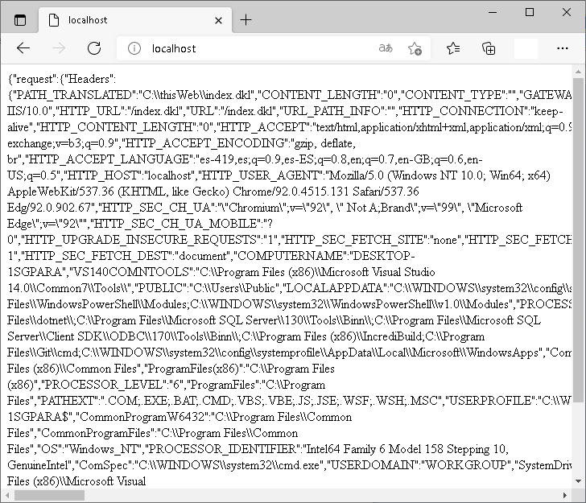

## Cómo funciona

Cuando se ha configurado el servidor Web para procesar solicitudes HTTP de recursos con extensión .dkl; a través de los mecanismos disponibles; se invoca al intérprete de Devkron (devkron.exe en Windows) con la ruta y nombre del archivo dkl requerido y se le proporciona toda la información del contexto HTTP en una variable global denominada: 

```DKL
@http_context
```

El siguiente programa (ejecutado como una página Web) muestra en formato JSON todo el contenido de @http_context.

```DKL
#include "dkli.dkh"

#$
html
{
    ##
    #include "serialize.dkh"
    ##

    body
    {
        p{$"#<to.json(@http_context)>"}
    }
}
```

Para probar el ejemplo, asegúrese de haber instalado y configurado los servicios de su servidor Web (IIS por ejemplo), cree un sitio Web y guarde en la carpeta correspondiente el programa como index.dkl



## La estructura @http_context

La variable global de referencia a una estructura @http_context contiene dos miembros principales: request y response.

### Información de la solicitud

El campo request contiene los siguientes miembros:

#### headers
Es una referencia a una estructura que contiene todos los encabezados HTTP de la solicitud.

#### cookies
Es una referencia a una estructura que contiene todas las cookies de la solicitud HTTP.

#### get
Es una referencia a una estructura que contiene todos los parámetros pasados en la cadena de la URL después del delimitador ? (comando GET de HTTP)

#### post
Es una referencia a una estructura que contiene todos los parámetros pasados mediante una solicitud POST codificada como application/x-www-form-urlencoded

Si el cuerpo de la solicitud POST no está codificada como se espera, el miembro no existe o está vacío.

#### post_string
Es una cadena que contiene el contenido del cuerpo de la solicitud POST si no está codificado como multipart/form-data

#### files
Es una referencia a una estructura que contiene todos los archivos enviados mediante POST codificados como multipart/form-data

### Control de la respuesta

El campo response de @http_context permite al programador definir los encabezados de respuesta, el formato y el origen de la misma.
#### headers

El campo headers del miembro response contiene los encabezados de respuesta.

De manera predeterminada, se incluyen los siguientes:
* Content-Type: text/html;charset=utf-8
* X-Powered-By: Devkron

#### output
El miembro output de response es una cadena que indica el origen de la salida y puede ser alguno de los siguientes:
* standard – Es el valor predeterminado e indica que el contenido de la respuesta será la salida del procesamiento del programa Devkron (un árbol XML)
* text – Establece que la salida será la cadena de texto indicada en el miembro text de response
* binary – Indica que la salida será un flujo de bytes referenciados por el miembro binary de reponse.

#### text
Este miembro contiene la cadena usada como contenido de la respuesta si se ha establecido 'text' como valor para output.

#### binary
Este miembro contiene una referencia a un array de bytes usado como la respuesta si se ha establecido ‘binary’ como valor para output.

