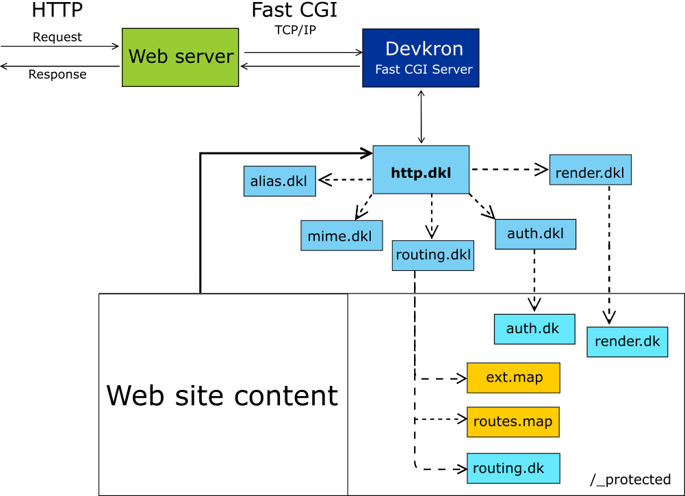

## Flujo HTTP a través de Devkron FastCGI Server

El flujo solicitud (request)/respuesta (response) HTTP gestionado a través de Devkron FastCGI Server se describe de la siguiente manera:
1. Un cliente HTTP envía al servidor Web una solicitud
2. El servidor Web; según se ha configurado; transfiere la solicitud HTTP al “servidor ascendente” a través del protocolo FastCGI/TCP IP 
3. El “servidor ascendente” es el servidor Devkron FastCGI que reúne toda la información de contexto de la solicitud HTTP y la proporciona al programa http.dkl
4. El programa http.dkl se apoya en los siguientes programas (en orden):
    -  alias.dkl determina la lógica aplicable en el caso de alias de hosts configurados.
    -  mime.dkl establece la manera como serán tratados los diferentes tipos de archivos que hayan sido solicitados y el encabezado de tipo de contenido a responder
    -  routing.dkl permite controlar y configurar el enrutamiento de los recursos, para lo cual se apoya en los siguientes archivos ubicados en la carpeta protegida del contenido del sitio Web (si están disponibles):
        + ext.map. Incluye reglas de enrutamiento con base en la extensión del recurso solicitado.
        + routes.map. Incluye reglas de enrutamiento con base en el URI solicitado y la transferencia de parámetros.
        + routing.dk. Es un programa de enrutamiento de propósito específico.
    - auth.dkl. Controla la autorización de acceso a los recursos apoyándose a su vez con el programa auth.dk (si está disponible) en la carpeta protegida del sitio Web.
    - render.dkl. Permite controlar centralizadamente la respuesta estándar, para lo cual se apoya en el programa render.dk (si está disponible) en la carpeta protegida del sitio Web. 
5. Una vez que el programa http.dkl ha completado su ejecución, devuelve la información de la respuesta (@http_context) al servidor Devkron FastCGI que a su vez la envía al servidor Web, el cual finalmente la entrega al cliente HTTP.

HTTP es un protocolo sin estado basado en texto, cuya especificación es pública y puede consultarse en el sitio web del W3C, así como una explicación útil puede leerse en la Mozilla Developer Network [https://developer.mozilla.org/es/docs/Web/HTTP/Overview]
