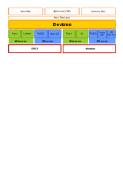

# Devkron Stack
La pila de Devkron se refiere al sistema operativo, servidor Web, servidor de bases de datos y servidor Devkron que soportan sitios Web (que entregan contenido dinámico), aplicaciones y servicios.

