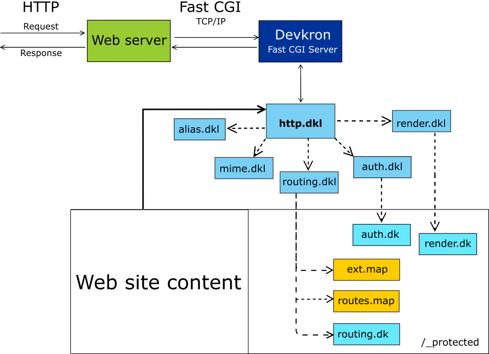

## Flujo HTTP a través de Devkron FastCGI Server



El flujo solicitud (request)/respuesta (response) HTTP gestionado a través de Devkron FastCGI Server se describe de la siguiente manera:
1. Un cliente HTTP envía al servidor Web una solicitud
2. El servidor Web; según se ha configurado; transfiere la solicitud HTTP al “servidor ascendente” a través del protocolo FastCGI/TCP IP 
3. El “servidor ascendente” es el servidor Devkron FastCGI que reúne toda la información de contexto de la solicitud HTTP y la proporciona al programa http.dkl
4. El programa http.dkl se apoya en los siguientes programas (en orden):
    -  alias.dkl determina la lógica aplicable en el caso de alias de hosts configurados.
    -  mime.dkl establece la manera como serán tratados los diferentes tipos de archivos que hayan sido solicitados y el encabezado de tipo de contenido a responder
    -  routing.dkl permite controlar y configurar el enrutamiento de los recursos, para lo cual se apoya en los siguientes archivos ubicados en la carpeta protegida del contenido del sitio Web (si están disponibles):
        + ext.map. Incluye reglas de enrutamiento con base en la extensión del recurso solicitado.
        + routes.map. Incluye reglas de enrutamiento con base en el URI solicitado y la transferencia de parámetros.
        + routing.dk. Es un programa de enrutamiento de propósito específico.
    - auth.dkl. Controla la autorización de acceso a los recursos apoyándose a su vez con el programa auth.dk (si está disponible) en la carpeta protegida del sitio Web.
    - render.dkl. Permite controlar o modificar centralizadamente la respuesta justo antes de enviarla al cliente, para lo cual se apoya en el programa render.dk (si está disponible) en la carpeta protegida del sitio Web. 
5. Una vez que el programa http.dkl ha completado su ejecución, devuelve la información de la respuesta (@http_context) al servidor Devkron FastCGI que a su vez la envía al servidor Web, el cual finalmente la entrega al cliente HTTP.

HTTP es un protocolo sin estado basado en texto, cuya especificación es pública y puede consultarse en el sitio web del W3C, así como una explicación útil puede leerse en la Mozilla Developer Network [https://developer.mozilla.org/es/docs/Web/HTTP/Overview]

## Carpeta protegida del sitio Web

La carpeta protegida del sitio Web es de manera predeterminada ```/_protected```, puede cambiar este valor a través de la variable global ```@http_protected_dir```  definida en ```http.dkl```

Como seguramente ya sabe, al instalar el servidor Devkron FastCGI se crea la carpeta ```web``` en la ubicación de los binarios, deberá crear una carpeta con el nombre de cada Host gestionado, por ejemplo para el sitio Web ```churrumaisconlimoncito.com```, tendrá la ruta: ```instalación_devkron/web/churrumaisconlimoncito.com/```

Si lo requiere, deberá crear la carpeta protegida y colocar ahí los archivos que necesita, por ejemplo:  
```instalación_devkron/web/churrumaisconlimoncito.com/_protected/routes.map```

Si algún archivo del sistema (```ext.map```, ```routes.map```, ```routing.dk```, ```auth.dk``` o ```render.dk```) no existe o no existe la carpeta protegida, Devkron FastCGI simplemente continuará normalmente asumiendo una correspondencia entre cada recurso solicitado en el URI con la estructura de carpetas del sitio Web.

Ningún recurso en la carpeta protegida será entregado por el servidor Devkron FastCGI directamente, por lo que el URI: ```https://churrumaisconlimoncito.com/_protected/routes.map``` devolverá el error "Acceso prohibido" al navegador del usuario.

## Enrutamiento 

Devkron utiliza el programa ```routing.dkl``` para determinar la ubicación real de un recurso en el sistema de archivos.

Modifique ```routing.dkl``` para establecer lógica común de enrutamiento para todos los sitios Web gestionados por la instancia de servidor Devkron FastCGI, pero si necesita controlar específicamente cada sitio Web, la mejor manera de hacerlo es a través de los archivos: ```ext.map```, ```routes.map``` y ```routing.dk``` que puede colocar en la carpeta protegida del sitio Web.

### Enrutamiento por extensión

Para utilizar las extensiones en los URI de recursos solicitados para en-rutar hacia programas DKL específicos deberá crear un archivo ext.map en la carpeta protegida.

El archivo ```ext.map``` es un archivo de texto simple en donde cada línea es una regla de enrutamiento.

Cada línea (regla) tiene la siguiente sintaxis:

```[Métodos HTTP:]Extensión > Recurso_local```

En donde:
*	Métodos HTTP. Es un argumento opcional, que contiene uno o más nombres de métodos HTTP (GET, POST, etc.) delimitados por comas
*	Extensión. Es una cadena de extensión de archivo (.exe, .api, etc.)
*	Recurso_local. Es el nombre y ruta relativa o absoluta del recurso que será devuelto por el servidor Devkron FastCGI

Ejemplo:

```post: .api > servicios/servicio_api.dkl```

Esta regla se cumple si la solicitud HTTP se realiza a través del método POST y el recurso tiene una extensión ```.api```.

Por ejemplo: ```https://churrumaisconlimoncito.com/miservicio1.api``` provocará que el servidor ejecute el programa ```/instalación_devkron/web/churrumaisconlimoncito.com/servicios/servicio_api.dkl```

#### Especificaciones de método
Puede indicar uno o más métodos, así como los comodines ```any``` o ```*``` para indicar que la regla aplica para todos los métodos, del mismo modo si omite la especificación de método se asumirá que es aplicable a todos.

Ejemplos de reglas:

```post, put: .api > servicios/servicio_api.dkl```

(Métodos POST y PUT únicamente)

```get: .api > servicios/servicio_api.dkl```

(Método GET únicamente)

Las reglas siguientes son equivalentes (y aplican a todos los métodos):

```*: .api > servicios/servicio_api.dkl```

```any: .api > servicios/servicio_api.dkl```

```.api > servicios/servicio_api.dkl```

#### Comodines para el nombre del recurso

Puede que el nombre del programa que desea se ejecute sea el que se indica en el URI de la solicitud, para lo cual puede usar el comodín ```*``` en el nombre del recurso.

Por ejemplo la regla: 
```post: .api > /_protected/servicios/*.dkl```

Provoca que el URI ```https://churrumaisconlimoncito.com/miservicio1.api``` ejecute el programa:
```/instalación_devkron/web/churrumaisconlimoncito.com/_protected/servicios/miservicio1.dkl```

Ahora bien, seguramente habrá observado que la ruta del recurso es relativa a la carpeta física del sitio Web, para evitar este comportamiento puede usar el comodín ```$``` al inicio del nombre del recurso y así especificar una ubicación absoluta en su sistema de archivos.

Ejemplo: 

```post: .api > $/etc/micarpeta/servicios/*.dkl```

#### Tratamiento como comentarios

Todas las líneas que inicien con el carácter ```#``` en un archivo ```.map``` serán ignoradas

### Enrutamiento por URI y transferencia de parámetros

Para utilizar una URI completa para en-rutar y entregar parámetros a un programa DKL, deberá crear un archivo llamado ```routes.map``` en la carpeta protegida del sitio Web.

El archivo ```routes.map``` es un archivo de texto simple, en donde cada línea de texto es una regla. 

La sintaxis de una regla es:

```[Métodos HTTP:]Patrón_URI > ProgramaDKL```

En donde:
*	Métodos HTTP. Es un argumento opcional, que contiene uno o más nombres de métodos HTTP (GET, POST, etc.) delimitados por comas
*	Patró_nURI. Es una cadena al estilo de una ruta que puede señalizar parámetros.
*	ProgramaDKL. Es el nombre y ruta relativa o absoluta del programa que será ejecutado por el servidor Devkron FastCGI

Ejemplo:

```post : /services/customers/{id_cliente}/reports/{id_reporte} > /_protected/programa.dkl```

Los siguientes URIs cumplirán la regla y ejecutarán al programa indicado pasándole los parámetros ```id_cliente``` e ```id_reporte``` en el miembro ```request/get``` de ```@http_context```

Los parámetros se pasan como si fueran parámetros GET para facilitar la adopción del modelo de rutas al estilo RESTFul. Es importante que tome en cuenta que si la URI tiene parámetros GET con los mismos nombres de parámetros en el patrón de la regla, estos se sobrepondrán a los primeros, para evitar este comportamiento, puede indicar un prefijo para identificarlos estableciendo la variable global ```@prefix_uri_params``` en ```http.dkl```

#### Especificaciones de método

Puede indicar uno o más métodos, así como los comodines ```any``` o ```*``` para indicar que la regla aplica para todos los métodos, del mismo modo si omite la especificación de método se asumirá que es aplicable a todos.

Ejemplos:

```post,put : /services/customers/{id_cliente}/reports/{id_reporte} > /_protected/programa.dkl```

(POST y PUT)

```/services/customers/{id_cliente}/reports/{id_reporte} > /_protected/programa.dkl```

(Cualquier método)

Las siguientes reglas son equivalentes:

```/services/customers/{id_cliente}/reports/{id_reporte} > /_protected/programa.dkl```

```*:/services/customers/{id_cliente}/reports/{id_reporte} > /_protected/programa.dkl```

```any:/services/customers/{id_cliente}/reports/{id_reporte} > /_protected/programa.dkl```

#### Parámetro opcional
En algunos casos, es possible que el último parámetro y parte de un patrón de URI sea opcional, para indicarlo deberá agregar el carácter ```?``` al final del nombre del parámetro.

Ejemplo:

```/services/customers/{id_cliente?} > /_protected/addorupdate.dkl```

#### Parámetros numéricos
Si desea indicar que el parámetro de una regla debe ser numérico anteponga el carácter #al nombre.

Ejemplo:

```get : /publicaciones/{#year}/{#month} > publicaciones.dkl```

#### Ruta relativa y absoluta del programa

De forma predeterminada, la ruta del programa a ejecutar por la regla se considera relativa a la carpeta del sitio Web, sin embargo puede especificar que se trata de una ruta absoluta anteponiendo el carácter ```$```

Ejemplo:

```get : /publicaciones/{#year}/{#month} > $/etc/publicaciones.dkl```

#### Prioridad de reglas

La única prioridad de las reglas está establecida por el orden en que están dispuestas en el archivo routes.map, por lo que la primera que coincida será la que se active.

#### Tratamiento como comentarios

Todas las líneas que inicien con el carácter ```#``` en un archivo ```.map``` serán ignoradas

### Enrutamiento avanzado

Si las facilidades del enrutamiento por extensión o por patrones de URI no son suficientes para sus requerimientos, puede escribir la lógica necesaria en DKL en un archivo ```routing.dk``` que deberá colocar en la carpeta protegida del sitio Web.

El programa ```routing.dk``` es ejecutado inmediatamente después de que se procesan las reglas de ```ext.map``` y las de ```routes.map```.

El programa ```routing.dk``` recibe una variable global denominada ```@http_request``` con la infomación necesaria para controlar el flujo de la solicitud HTTP.

## Autorización

Si requiere lógica para controlar el acceso a los recursos de todos los sitios Web modifique el archivo ```auth.dkl```.

Si requiere establecer lógica de autorización para los recursos de un sitio Web en particular, cree el archivo ```auth.dk``` en la carpeta protegida del sitio Web.

Un archivo ```auth.dk``` es un programa DKL que recibe una variable global llamada ```@http_request``` que permitirá controlar el flujo de la solicitud.

Desencadenar una excepción con la función rise_error provocará la detención del flujo de la solicitud y es en la mayoría de los casos, la mejor opción para restringir el acceso a un recurso.

## Post-procesamiento centralizado

Si requiere procesar la respuesta justo antes de ser enviada al servidor Web de todos los sitios Web puede modificar el archivo ```render.dkl```.

Si requiere procesar la respuesta únicamente de un sitio Web en particular, cree un archivo llamado ```render.dk``` en la carpeta protegida del sitio Web.

El programa ```render.dk``` será ejecutado al final del flujo de la solicitud (cuando la respuesta ya está lista para entregarse).

Un escenario común de utilización de un archivo ```render.dk``` sería por ejemplo: Generar HTML a partir de un archivo Markdown solicitado y "envolverlo" todo en una plantilla usada para todo el sitio Web.

El programa ```render.dk``` a diferencia de los demás archivos ```.dk``` que reconoce el servidor Devkron FastCGI, NO recibe la variable ```@http_request``` (porque la solicitud ya ha sido completada), en su lugar obtiene la conocida variable global ```@http_context```.

## Variable @http_request
Esta variable global es el mecanismo mediante el cual el programa http.dkl permite el control del flujo de la solicitud y solo está disponible para los programas ```routing.dk``` y ```auth.dk```. En todos los demás casos la variable que representa el contexto completo es @http_context.

Campos de ```@http_request```

* host . Es una cadena que contiene el nombre del HOST indicado en la solicitud HTTP
* uri. Es una cadena que contiene el URI del documento en el sistema de archivos local
* base_path. Es una cadena con la ruta del sitio Web en el sistema de archivos local
* document_path. Es una cadena con la ruta y nombre del recurso en el sistema local que se entregará
* http_context. Es una estructura (registro) que contiene todo el contexto HTTP hasta el momento, (hasta el momento significa que puede ir cambiando conforme se va procesando la solicitud).

Al modificar los valores de los campos de ```@http_request```, puede controlar la forma como se completa la solicitud.
Por ejemplo, si modificar ```document_path``` para indicar la ruta y nombre del recurso, controlará lo que el servidor responde.
