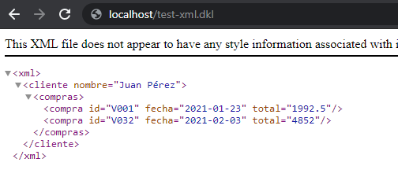

## Responder HTML o XML 

La salida de un programa DKL es un árbol XML, por lo tanto puede producirse HTML fácilmente como se muestra a continuación:

```DKL
#include "dkli.dkh"

/* Establecer la declaración de tipo de documento 
   con base en la recomendación del w3c 
   https://www.w3.org/QA/2002/04/valid-dtd-list.html */

#set "meta-xml-declaration" "<!DOCTYPE html>\r\n" 

// Contenido HTML codificado en DKL
html
{
    head
    {
        title{$"Título de la página"}
    }

    body
    {
        h1{$"Encabezado"}
        p{$"Párrafo de texto"}
    }
}
```
Salida HTML

```HTML
<!DOCTYPE html>
	<html >
		<head >
			<title >
				Título de la página
			</title>
		</head>
		<body >
			<h1 >
				Encabezado
			</h1>
			<p >
				Párrafo de texto
			</p>
		</body>
	</html>
```

Del mismo modo, devolver XML se implementa así:

``` DKL
#include "dkli.dkh"

// Contenido XML codificado en DKL

xml //Siempre debe existir un único nodo raíz
{
    #! //Conmutación de contexto (a IMPERATIVO)
    @http_context<"response/headers/content-type">:"text/xml;charset=utf-8" //Establece encabezado de respuesta http
    #$ //Conmutación de contexto (a DECLARARIVO)

    cliente(nombre="Juan Pérez")
    {
        compras
        {
            compra(id="V001" fecha="2021-01-23" total="1992.5")
            compra(id="V032" fecha="2021-02-03" total="4852")
        }
    }
}
```

Salida en el navegador

</img>
