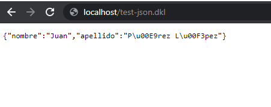
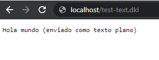

## Responder JSON o texto plano

En el caso de las respuestas JSON o de texto plano basta con establecer el campo output del miembro response de @http_context como se muestra en los siguientes ejemplos:

### Generar salida en JSON

``` DKL
#include "dkli.dkh"
#! //Conmutación a contexto IMPERATIVO

program "ejemplo-JSON"
{
    #include "serialize.dkh" //Biblioteca de serialización

    //Crear un registro
    new datos
    {
        @"nombre":"Juan"
        @"apellido": "Pérez López"
    }

    //Establecer encabezado de respuesta http
    @http_context<"response/headers/content-type">:"application/json;charset=utf-8"

    //Indicar tipo de respuesta
    @http_context<"response/output">:"text"

    //Asignar la respuesa de salida
    @http_context<"response/text">: to.json(datos)
}
```
</img>

### Generar una salida de texto plano

``` DKL
#include "dkli.dkh"
#! //Conmutación a contexto IMPERATIVO

program "ejemplo-TEXTO-PLANO"
{
    //Establecer encabezado de respuesta http
    @http_context<"response/headers/content-type">:"text/plain;charset=utf-8"

    //Indicar tipo de respuesta
    @http_context<"response/output">:"text"

    //Asignar la respuesa de salida
    @http_context<"response/text">: "Hola mundo (enviado como texto plano)"
}
```

</img>

Siempre es importante establecer el tipo de contenido (content-type), vea la lista completa de tipos MIME en: https://developer.mozilla.org/en-US/docs/Web/HTTP/Basics_of_HTTP/MIME_types/Common_types
